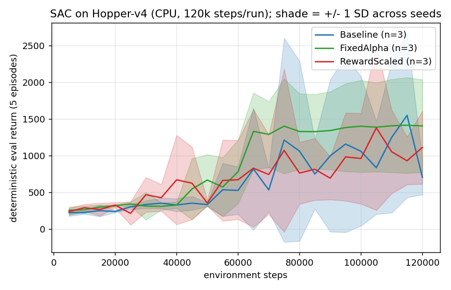
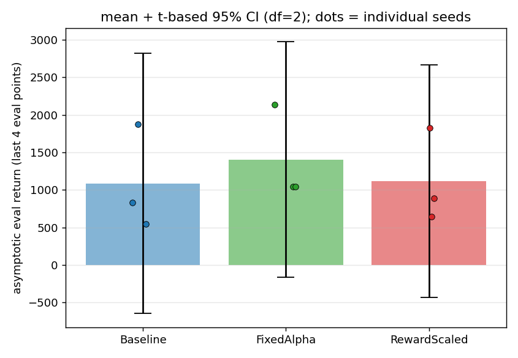

# embodied-offpolicy-study

A small, honest, from-scratch reinforcement-learning study built to demonstrate
real research ability for a PhD (Embodied AI / RL) application.

- **Algorithm**: Soft Actor-Critic (SAC) implemented **from scratch in PyTorch**
  (no Stable-Baselines3). Twin critics, soft target updates, tanh-squashed Gaussian
  actor, automatic entropy temperature.
- **Envs**: Pendulum-v1 (validation) + Hopper-v4 (the study).
- **Study**: does critic-side **reward scaling** (0.1 vs 1.0) change sample
  efficiency / asymptotic return? 3 seeds per arm, plus a fixed-alpha control.
  Pre-registered in `PRE_REGISTRATION.md`.
- **Hardware honesty**: all runs are **CPU only**, **120k env steps per run**
  (restored to the pre-registered budget). This is *not* a 1M-step benchmark;
  numbers are reported as measured.

## Layout

```
src/            from-scratch SAC (replay buffer, actor, twin critic, agent)
tests/          pytest: buffer sampling, actor bounds/logprob, critic shapes
configs/        YAML per setting (pendulum_ci, pendulum, hopper baseline/rewardscale/fixedalpha)
train.py        training loop -> logs/<run>/progress.csv (per-episode + eval rows)
ci_check.py     fast Pendulum learn-gate used by CI
plot.py         reads raw CSVs -> learning curve + asymptotic bar chart + Welch/ANOVA
logs/<run>/progress.csv   RAW step logs (committed, not fabricated)
figures/        plots produced by plot.py
PRE_REGISTRATION.md       hypothesis registered before results
RESEARCH_RETRO.md         short human-readable write-up
```

## Quick start

```bash
pip install -r requirements.txt

# unit tests
pytest tests/ -q

# validation: prove the agent learns on Pendulum
python train.py --config configs/sac_pendulum.yaml --seed 0 --out logs/pendulum_val_s0

# one arm of the study (repeat for each seed / config)
python train.py --config configs/sac_hopper_baseline.yaml    --seed 0 --out logs/hopper_baseline_s0
python train.py --config configs/sac_hopper_rewardscale.yaml --seed 0 --out logs/hopper_rewardscale_s0
python train.py --config configs/sac_hopper_fixedalpha.yaml  --seed 0 --out logs/hopper_fixedalpha_s0

# plot from the raw CSVs
python plot.py
```

## Results

Deterministic eval return (5 episodes), Hopper-v4, CPU, **120k steps/run**, 3 seeds
per arm. Three arms: Baseline (scale=1.0, auto alpha), RewardScaled (scale=0.1,
auto alpha), and FixedAlpha (scale=0.1, alpha frozen at 0.2, no auto-tune — this arm
separates "reward scaling" from "auto-tuned alpha dynamics").

Asymptotic window = **last 4 eval points (105k–120k)** = last 20% of training.

| Arm | asymptotic return (mean ± SD, n=3) |
|---|---|
| Baseline (reward_scale=1.0) | **1085 ± 698** |
| RewardScaled (reward_scale=0.1) | **1118 ± 623** |
| FixedAlpha (auto_tune=off) | **1404 ± 632** |

Per-seed tail means: baseline = 547, 833, 1873; reward-scaled = 645, 886, 1824;
fixed-alpha = 1039, 1039, 2133.

Stats (`python plot.py`, scipy exact distributions; n=3, df=2): the t-based 95% CI
half-widths are ~±1550–1730 (t₀.₉₇₅,₂ = 4.303), showing how little n=3 actually
pins the mean. Pairwise Welch t (`ttest_ind`, equal_var=False): Baseline vs
FixedAlpha p=0.589; Baseline vs RewardScaled p=0.953; FixedAlpha vs RewardScaled
p=0.607. One-way ANOVA (`f_oneway`): F=0.22, p=0.811.

**Interpretation (honest): at 120k steps there is no detectable effect.** All three
arms land on statistically indistinguishable means with large seed-to-seed variance.
The earlier 60k run looked like reward-scaling won by ~3x; restoring the
pre-registered 120k budget and adding the fixed-alpha control shows that was seed
noise, not a real benefit. Fixed-alpha sits a little higher on average but nowhere
near significantly (all p > 0.58). I am explicitly **not** claiming reward scaling
helps — the data say it does not, at this budget and variance.





The summary table and statistics are reproduced by running `python plot.py` on the
committed CSVs.

## References

- Haarnoja, Z., Zhou, A., Abbeel, P., & Levine, S. (2018). *Soft Actor-Critic:
  Off-Policy Maximum Entropy Deep Reinforcement Learning with a Stochastic Actor.*
  arXiv:1801.01290.

## CI

`.github/workflows/ci.yml` on every push:
1. byte-compile (lint),
2. `pytest`,
3. train on Pendulum for a few thousand steps and **assert the deterministic eval
   return improves** (`ci_check.py`) — this proves the code actually learns, not
   just runs.

## Honest limitations

- Single environment (Hopper-v4), **120k steps**, CPU. Not SOTA, not 1M steps.
- Reward scaling is a known sensitivity; this is a controlled ablation, not a new
  algorithm. At n=3 and this variance we have **no power** to detect modest effects;
  a null here means "not detectable", not "no effect".
- We bootstrap on time-limit truncation (correct), but do not normalise rewards.
- MuJoCo env warned that Hopper-v4 is superseded by v5; we stayed on v4 to match
  classic SAC benchmarks.
